# 船舶PDM接口测试工具 - 数据库ER关系图

## 📊 数据库关系图（Mermaid格式）

```mermaid
erDiagram
    %% 文件夹自关联
    TEMPLATE_FOLDER ||--o{ TEMPLATE_FOLDER : "parent_id - 父子关系"
    
    %% 模板与文件夹
    TEMPLATE_FOLDER ||--o{ INTERFACE_TEMPLATE : "folder_id - 一对多"
    
    %% 模板与子表（一对多关系）
    INTERFACE_TEMPLATE ||--o{ TEMPLATE_HEADER : "template_id"
    INTERFACE_TEMPLATE ||--o{ TEMPLATE_PARAMETER : "template_id"
    INTERFACE_TEMPLATE ||--o{ TEMPLATE_FORM_DATA : "template_id"
    INTERFACE_TEMPLATE ||--o{ TEMPLATE_ASSERTION : "template_id"
    INTERFACE_TEMPLATE ||--o{ TEMPLATE_PRE_PROCESSOR : "template_id"
    INTERFACE_TEMPLATE ||--o{ TEMPLATE_POST_PROCESSOR : "template_id"
    INTERFACE_TEMPLATE ||--o{ TEMPLATE_VARIABLE : "template_id"
    INTERFACE_TEMPLATE ||--o{ TEMPLATE_ENVIRONMENT : "template_id"
    INTERFACE_TEMPLATE ||--o{ TEMPLATE_HISTORY : "template_id"
    INTERFACE_TEMPLATE ||--o{ TEMPLATE_FAVORITE : "template_id"
    INTERFACE_TEMPLATE ||--o{ TEMPLATE_USAGE_LOG : "template_id"
    INTERFACE_TEMPLATE ||--o{ TEMPLATE_SHARE : "template_id"
    
    %% 模板版本链自关联
    INTERFACE_TEMPLATE ||--o{ INTERFACE_TEMPLATE : "ref_template_id - 版本链"
    
    TEMPLATE_FOLDER {
        bigint id PK "主键ID"
        bigint parent_id FK "父分类ID"
        varchar name "分类名称"
        varchar description "分类描述"
        int sort_order "排序序号"
        varchar icon "图标"
        varchar color "颜色标识"
        bigint owner_id "创建人ID"
        varchar owner_name "创建人姓名"
        bigint team_id "所属团队ID"
        tinyint visibility "可见性"
        tinyint status "状态"
        datetime create_time "创建时间"
        datetime update_time "更新时间"
        datetime delete_time "删除时间"
    }
    
    INTERFACE_TEMPLATE {
        bigint id PK "主键ID"
        bigint folder_id FK "所属分类ID"
        varchar name "模板名称"
        text description "模板描述"
        varchar protocol_type "协议类型"
        varchar method "请求方法"
        varchar base_url "基础URL"
        varchar path "请求路径"
        varchar full_url "完整URL"
        varchar auth_type "认证类型"
        json auth_config "认证配置"
        varchar content_type "Content-Type"
        varchar charset "字符编码"
        varchar body_type "请求体类型"
        longtext body_content "请求体内容"
        varchar body_raw_type "RAW类型"
        int connect_timeout "连接超时"
        int read_timeout "读取超时"
        int retry_count "重试次数"
        int retry_interval "重试间隔"
        varchar version "版本号"
        varchar version_remark "版本说明"
        tinyint is_latest "是否最新"
        bigint ref_template_id "关联模板ID"
        bigint owner_id "创建人ID"
        varchar owner_name "创建人姓名"
        bigint team_id "所属团队ID"
        tinyint visibility "可见性"
        varchar tags "标签"
        varchar pdm_system_type "PDM系统类型"
        varchar pdm_module "PDM模块"
        varchar business_scene "业务场景"
        tinyint status "状态"
        int use_count "使用次数"
        datetime last_use_time "最后使用时间"
        datetime create_time "创建时间"
        datetime update_time "更新时间"
        datetime delete_time "删除时间"
    }
    
    TEMPLATE_HEADER {
        bigint id PK "ID"
        bigint template_id FK "模板ID"
        varchar header_name "Header名称"
        varchar header_value "Header值"
        varchar description "描述"
        tinyint is_enabled "是否启用"
        tinyint is_required "是否必填"
        tinyint is_variable "是否为变量"
        varchar variable_name "变量名"
        int sort_order "排序序号"
        datetime create_time "创建时间"
        datetime update_time "更新时间"
    }
    
    TEMPLATE_PARAMETER {
        bigint id PK "ID"
        bigint template_id FK "模板ID"
        varchar param_type "参数类型"
        varchar param_name "参数名称"
        varchar param_value "参数值"
        varchar data_type "数据类型"
        varchar description "参数描述"
        varchar example_value "示例值"
        tinyint is_required "是否必填"
        tinyint is_enabled "是否启用"
        tinyint is_variable "是否为变量"
        varchar variable_name "变量名"
        json validation_rules "验证规则"
        int sort_order "排序序号"
        datetime create_time "创建时间"
        datetime update_time "更新时间"
    }
    
    TEMPLATE_FORM_DATA {
        bigint id PK "ID"
        bigint template_id FK "模板ID"
        varchar field_name "字段名称"
        varchar field_type "字段类型"
        text field_value "字段值"
        varchar file_path "文件路径"
        varchar file_name "文件名"
        varchar content_type "Content-Type"
        varchar description "描述"
        tinyint is_required "是否必填"
        tinyint is_enabled "是否启用"
        tinyint is_variable "是否为变量"
        varchar variable_name "变量名"
        int sort_order "排序序号"
        datetime create_time "创建时间"
        datetime update_time "更新时间"
    }
    
    TEMPLATE_ASSERTION {
        bigint id PK "ID"
        bigint template_id FK "模板ID"
        varchar assert_name "断言名称"
        varchar assert_type "断言类型"
        varchar extract_path "提取路径"
        text expected_value "期望值"
        varchar operator "比较运算符"
        varchar data_type "数据类型"
        varchar error_message "错误信息"
        tinyint is_enabled "是否启用"
        varchar assert_group "断言分组"
        varchar logic_type "逻辑关系"
        int sort_order "排序序号"
        datetime create_time "创建时间"
        datetime update_time "更新时间"
    }
    
    TEMPLATE_PRE_PROCESSOR {
        bigint id PK "ID"
        bigint template_id FK "模板ID"
        varchar processor_name "处理器名称"
        varchar processor_type "处理器类型"
        json config "配置参数"
        text script_content "脚本内容"
        varchar target_variable "目标变量名"
        varchar variable_scope "变量作用域"
        varchar description "描述"
        tinyint is_enabled "是否启用"
        int sort_order "执行顺序"
        datetime create_time "创建时间"
        datetime update_time "更新时间"
    }
    
    TEMPLATE_POST_PROCESSOR {
        bigint id PK "ID"
        bigint template_id FK "模板ID"
        varchar processor_name "处理器名称"
        varchar processor_type "处理器类型"
        varchar extract_type "提取方式"
        varchar extract_expression "提取表达式"
        int extract_match_no "匹配序号"
        varchar target_variable "目标变量名"
        varchar variable_scope "变量作用域"
        varchar default_value "默认值"
        json config "配置参数"
        text script_content "脚本内容"
        varchar description "描述"
        tinyint is_enabled "是否启用"
        int sort_order "执行顺序"
        datetime create_time "创建时间"
        datetime update_time "更新时间"
    }
    
    TEMPLATE_VARIABLE {
        bigint id PK "ID"
        bigint template_id FK "模板ID"
        varchar variable_name "变量名"
        varchar variable_type "变量类型"
        text default_value "默认值"
        text current_value "当前值"
        varchar description "变量描述"
        varchar example_value "示例值"
        tinyint is_required "是否必填"
        tinyint is_editable "是否可编辑"
        tinyint is_persistent "是否持久化"
        varchar source_type "来源类型"
        json source_config "来源配置"
        json validation_rules "验证规则"
        int sort_order "排序序号"
        datetime create_time "创建时间"
        datetime update_time "更新时间"
    }
    
    TEMPLATE_ENVIRONMENT {
        bigint id PK "ID"
        bigint template_id FK "模板ID"
        varchar env_name "环境名称"
        varchar env_code "环境代码"
        varchar base_url "基础URL"
        json headers "环境Header"
        json variables "环境变量"
        varchar auth_type "认证类型"
        json auth_config "认证配置"
        tinyint proxy_enabled "是否启用代理"
        varchar proxy_host "代理主机"
        int proxy_port "代理端口"
        varchar proxy_username "代理用户名"
        varchar proxy_password "代理密码"
        tinyint is_default "是否为默认"
        varchar description "描述"
        datetime create_time "创建时间"
        datetime update_time "更新时间"
    }
    
    TEMPLATE_HISTORY {
        bigint id PK "ID"
        bigint template_id FK "模板ID"
        varchar version "版本号"
        varchar version_type "版本类型"
        varchar change_summary "变更摘要"
        text change_details "变更详情"
        longtext template_snapshot "模板快照"
        bigint operator_id "操作人ID"
        varchar operator_name "操作人姓名"
        varchar operation_type "操作类型"
        tinyint can_rollback "是否可回滚"
        datetime rollback_to_time "回滚时间点"
        datetime create_time "创建时间"
    }
    
    TEMPLATE_FAVORITE {
        bigint id PK "ID"
        bigint template_id FK "模板ID"
        bigint user_id "用户ID"
        tinyint favorite_type "类型:1-收藏2-关注"
        varchar remark "备注"
        datetime create_time "创建时间"
    }
    
    TEMPLATE_USAGE_LOG {
        bigint id PK "ID"
        bigint template_id FK "模板ID"
        varchar usage_type "使用类型"
        bigint user_id "用户ID"
        varchar user_name "用户姓名"
        bigint task_id "任务ID"
        tinyint execution_result "执行结果"
        int execution_duration "执行耗时"
        varchar request_summary "请求摘要"
        varchar response_summary "响应摘要"
        text error_message "错误信息"
        varchar client_ip "客户端IP"
        varchar user_agent "User-Agent"
        datetime create_time "创建时间"
    }
    
    TEMPLATE_IMPORT_EXPORT {
        bigint id PK "ID"
        varchar operation_type "操作类型"
        varchar template_ids "模板ID列表"
        bigint folder_id "文件夹ID"
        varchar file_name "文件名"
        varchar file_path "文件路径"
        bigint file_size "文件大小"
        varchar file_format "文件格式"
        tinyint status "状态"
        int success_count "成功数量"
        int fail_count "失败数量"
        text error_message "错误信息"
        bigint operator_id "操作人ID"
        varchar operator_name "操作人姓名"
        datetime start_time "开始时间"
        datetime end_time "结束时间"
        datetime create_time "创建时间"
    }
    
    TEMPLATE_SHARE {
        bigint id PK "ID"
        bigint template_id FK "模板ID"
        varchar share_type "共享类型"
        bigint share_target_id "共享对象ID"
        varchar share_target_name "共享对象名称"
        varchar permission "权限"
        tinyint can_share "是否允许再共享"
        datetime expire_time "过期时间"
        varchar share_code "共享码"
        varchar share_link "共享链接"
        varchar access_password "访问密码"
        bigint created_by "创建人ID"
        datetime create_time "创建时间"
        datetime update_time "更新时间"
    }
```



---

## 📋 表关系说明

### 1. 核心主表

#### template_folder（模板分类/文件夹）
- **自关联**：通过 `parent_id` 实现无限层级树结构
- **一对多**：一个文件夹可以包含多个模板

#### interface_template（接口模板主表）
- **核心字段**：存储协议类型、URL、认证、超时等基础配置
- **PDM特色字段**：`pdm_system_type`, `pdm_module`, `business_scene`
- **版本控制**：`version`, `ref_template_id` 实现版本链

### 2. 模板子表（一对多关系）

每个模板可以包含以下关联数据：

| 子表 | 用途 | 核心字段 |
|------|------|---------|
| template_header | HTTP请求头 | header_name, header_value |
| template_parameter | URL参数 | param_type(QUERY/PATH), param_name |
| template_form_data | 表单数据 | field_type(TEXT/FILE) |
| template_assertion | 响应断言 | assert_type, extract_path, expected_value |
| template_pre_processor | 前置处理器 | processor_type, script_content |
| template_post_processor | 后置处理器 | extract_type, extract_expression |
| template_variable | 变量定义 | variable_name, source_type |
| template_environment | 环境配置 | env_code, base_url, is_default |

### 3. 辅助表

| 表名 | 用途 | 说明 |
|------|------|------|
| template_history | 版本历史 | 保存完整模板JSON快照，支持回滚 |
| template_favorite | 收藏/关注 | favorite_type区分收藏(1)和关注(2) |
| template_usage_log | 使用记录 | 统计模板使用频率和执行情况 |
| template_import_export | 导入导出记录 | 跟踪导入导出任务状态 |
| template_share | 共享授权 | 支持按用户/团队/角色共享 |

---

## 🔗 外键关系汇总

| 表名 | 外键字段 | 关联表 | 关联字段 |
|------|---------|--------|---------|
| template_folder | parent_id | template_folder | id |
| interface_template | folder_id | template_folder | id |
| interface_template | ref_template_id | interface_template | id |
| template_header | template_id | interface_template | id |
| template_parameter | template_id | interface_template | id |
| template_form_data | template_id | interface_template | id |
| template_assertion | template_id | interface_template | id |
| template_pre_processor | template_id | interface_template | id |
| template_post_processor | template_id | interface_template | id |
| template_variable | template_id | interface_template | id |
| template_environment | template_id | interface_template | id |
| template_history | template_id | interface_template | id |
| template_favorite | template_id | interface_template | id |
| template_usage_log | template_id | interface_template | id |
| template_share | template_id | interface_template | id |

---

## 🎨 ER图架构

```
┌─────────────────────────────────────────────────────────────┐
│                      组织结构层                              │
├─────────────────────────────────────────────────────────────┤
│  template_folder (自关联树结构)                              │
└─────────────────────────────────────────────────────────────┘
                              │
                              ▼
┌─────────────────────────────────────────────────────────────┐
│                      模板核心层                              │
├─────────────────────────────────────────────────────────────┤
│  interface_template (版本链: ref_template_id)               │
└─────────────────────────────────────────────────────────────┘
                              │
        ┌─────────────────────┼─────────────────────┐
        │                     │                     │
        ▼                     ▼                     ▼
┌───────────────┐   ┌───────────────┐   ┌───────────────┐
│   请求配置     │   │   数据处理     │   │   结果验证     │
├───────────────┤   ├───────────────┤   ├───────────────┤
│ template_     │   │ template_pre_ │   │ template_     │
│   header      │   │   processor   │   │   assertion   │
│ template_     │   │ template_post_│   └───────────────┘
│   parameter   │   │   processor   │
│ template_     │   │ template_     │
│   form_data   │   │   variable    │
└───────────────┘   └───────────────┘
                              │
                              ▼
┌─────────────────────────────────────────────────────────────┐
│                      环境配置层                              │
├─────────────────────────────────────────────────────────────┤
│  template_environment (支持多环境切换)                       │
└─────────────────────────────────────────────────────────────┘
                              │
                              ▼
┌─────────────────────────────────────────────────────────────┐
│                      辅助功能层                              │
├─────────────────────────────────────────────────────────────┤
│  template_history    - 版本历史                             │
│  template_favorite   - 收藏/关注                            │
│  template_usage_log  - 使用统计                             │
│  template_import_export - 导入导出                          │
│  template_share      - 共享授权                             │
└─────────────────────────────────────────────────────────────┘
```

---

## 📐 查看ER图

### 方式1：使用PlantUML（推荐）
1. 安装PlantUML插件（IDEA/VSCode）
2. 打开 `docs/database-er-diagram.puml`
3. 自动渲染ER图

### 方式2：使用Mermaid
1. 在支持Mermaid的Markdown查看器中打开本文档
2. 或复制Mermaid代码到 https://mermaid.live

### 方式3：使用在线工具
- 将 `.puml` 文件内容粘贴到 https://www.plantuml.com/plantuml
