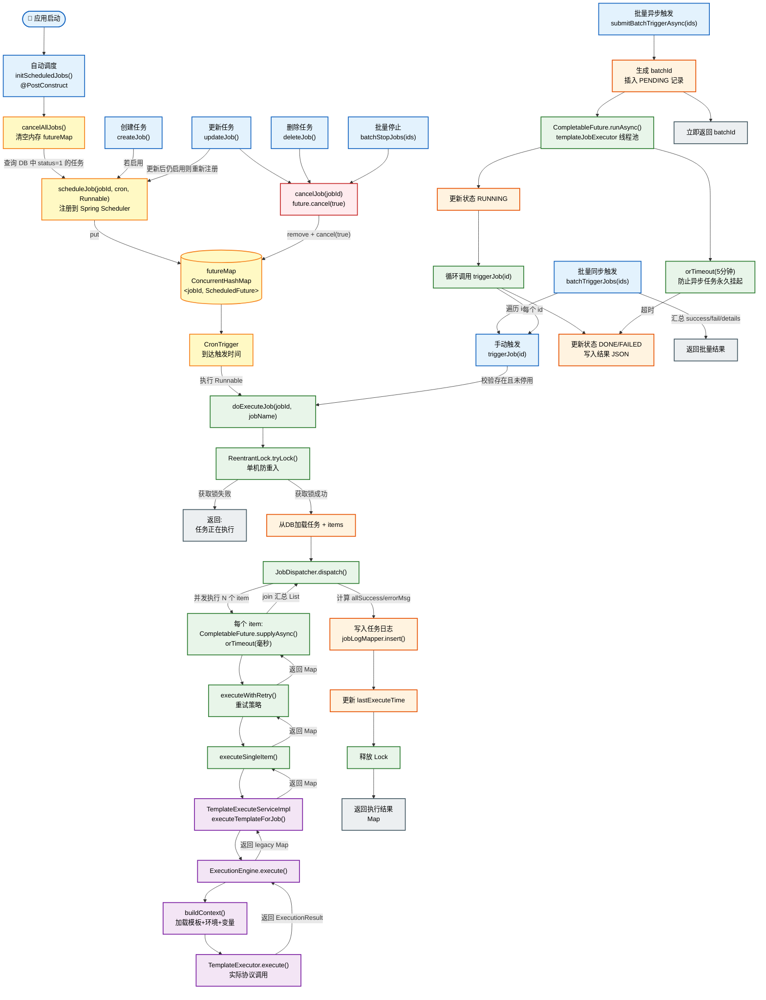

# 模板任务调度流程图

> 本图涵盖自动调度、手动触发、批量同步/异步触发、取消停止等完整链路。
> 使用 [Mermaid](https://mermaid.js.org/) 语法绘制，可在支持 Mermaid 的 Markdown 编辑器或 GitLab/GitHub 中直接渲染。



---

## 流程说明

### 1. 自动调度（绿色链路）
- **触发时机**：应用启动时 `@PostConstruct` 执行 `initScheduledJobs()`
- **流程**：先调用 `cancelAllJobs()` 清理内存中旧任务 → 从数据库加载 `status=1`（启用）的任务 → 通过 `DynamicJobScheduler.scheduleJob()` 注册到 Spring 的 `ThreadPoolTaskScheduler` → 按 Cron 表达式定时触发 `doExecuteJob()`
- **关键点**：单机环境下启动前清空旧 future，防止热重启/上下文刷新导致的**重复注册**

### 2. 手动触发（蓝色链路）
- **入口**：`POST /api/template/job/{id}/trigger`
- **流程**：`triggerJob(id)` 校验任务存在且未停用 → **直接调用** `doExecuteJob()`
- **特点**：不走 Cron 调度器，立即执行

### 3. 批量同步触发（橙色链路）
- **入口**：`POST /api/template/job/batch/trigger`
- **流程**：`batchTriggerJobs(ids)` 遍历每个 id，逐个调用 `triggerJob(id)` → 汇总成功/失败列表和详情返回
- **特点**：接口同步阻塞，直到所有任务执行完毕才返回，适合任务数量少、需要立即知道结果的场景

### 4. 批量异步触发（紫色链路）
- **入口**：`POST /api/template/job/batch/trigger-async`
- **流程**：
  1. 生成 `batchId`，持久化 **PENDING** 状态到 `template_job_batch` 表
  2. 立即返回 `batchId` 给调用方
  3. 在 `templateJobExecutor` 线程池中异步执行：更新为 **RUNNING** → 调用 `batchTriggerJobs()` → 完成后更新为 **DONE** 并写入结果 JSON
  4. 外层设置 `orTimeout(5分钟)`，若整体超时则更新为 **FAILED**
- **特点**：接口不阻塞，调用方通过 `GET /batch/{batchId}/status` 轮询结果

### 5. 取消 / 停止 / 更新 / 删除（红色链路）
- **更新任务**：`updateJob()` 先 `cancelJob(id)` 取消旧调度，如果更新后状态仍为启用，则重新 `scheduleJob()`
- **删除任务**：`deleteJob()` 先 `cancelJob(id)`，再软删除（`is_deleted=1`）
- **批量停止**：`batchStopJobs(ids)` 对每个 id 调用 `cancelJob(id)`，并将数据库状态改为停用（`status=0`）
- **cancelJob 行为**：从 `futureMap` 中移除并调用 `future.cancel(true)`，允许**中断**正在执行的任务线程

### 6. 核心执行链路（doExecuteJob）
```
doExecuteJob()
  ├── ReentrantLock.tryLock()      ← 单机防重入，若未获取锁直接返回"任务正在执行"
  ├── 加载任务详情和 items
  ├── JobDispatcher.dispatch()
  │     └── 对每个 item 异步执行（带毫秒级超时 + 重试）
  │           └── executeSingleItem()
  │                 └── executeTemplateForJob()
  │                       └── ExecutionEngine.execute()
  │                             └── TemplateExecutor.execute()  ← 实际协议请求
  ├── 汇总结果，计算 allSuccess / errorMsg
  ├── 写入 job_log 表
  ├── 更新 job.last_execute_time
  └── 释放 Lock
```

### 7. 关键设计点
| 设计点 | 说明 |
|--------|------|
| **单机锁 ReentrantLock** | 防止同一 job 在单个 JVM 内并发执行（自动调度与手动触发冲突时保护） |
| **futureMap + cancel(true)** | 内存中维护调度句柄，支持主动取消并中断运行中线程 |
| **启动前 cancelAllJobs** | 防止应用重启/热部署后旧任务未清理导致的重复注册 |
| **JobDispatcher 单层异步** | 仅在外层对每个 item 使用 `supplyAsync + orTimeout`，避免双层线程池嵌套导致线程数翻倍 |
| **毫秒级超时** | `orTimeout(timeout, TimeUnit.MILLISECONDS)` 与配置项 `template.job.item.timeout-ms` 语义一致 |
